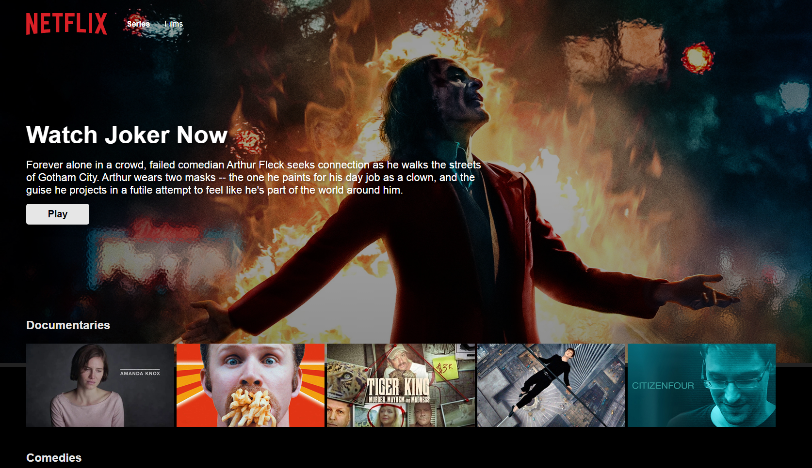

# Netflix clone app using React, Firebase, Compound components pattern & Styled Components

## Built with

- [React.js (Custom Hooks, Context, Portals)](https://react.dev/)
- [Styled Components](https://styled-components.com/)
- [Firebase](https://firebase.google.com/)

## Tested with

- [Jest](https://jestjs.io/)

## Test credentials for login

Email: test@test.com<br/>
Password: testzeta<br/>

## Running the project

This is a [React.js](https://react.dev/) project bootstrapped with [`create-react-app`](https://create-react-app.dev/).

- Clone the project

```bash
  git clone https://github.com/Qnemes/netflix-clone.git
```

- Go to the project directory

```bash
  cd netflix-clone
```

- Install dependencies

```bash
  npm install
```

- Create a .env file

- Create a project inside Google Firebase and export the configuration
- Add the configuration inside the .env file created previously

```
REACT_APP_API_KEY=REACT_APP_FIREBASE_API_KEY
REACT_APP_AUTH_DOMAIN=REACT_APP_FIREBASE_AUTH_DOMAIN
REACT_APP_PROJECT_ID=REACT_APP_FIREBASE_PROJECT_ID
REACT_APP_STORAGE_BUCKET=REACT_APP_FIREBASE_STORAGE_BUCKET
REACT_APP_MESSAGING_SENDER_ID=REACT_APP_FIREBASE_MESSAGING_SENDER_ID
REACT_APP_APP_ID=REACT_APP_FIREBASE_APP_ID
REACT_APP_FIREBASE_MEASUREMEMT_ID=REACT_APP_FIREBASE_MEASUREMEMT_ID
```

- In the project directory, you can run this to start local server:

```bash
  npm start
```

It runs the app in the development mode.<br />
Open [http://localhost:3000](http://localhost:3000) to view it in the browser.

Or you can visit deployed version directly by visiting the [link](https://reactzetflix-app.netlify.app/)


