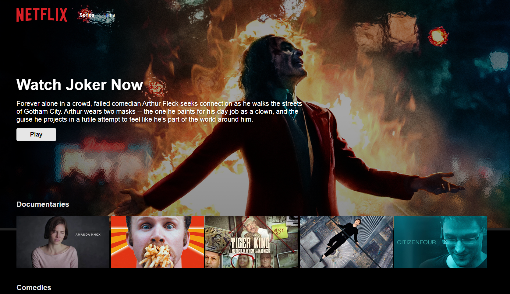

## Netflix app using React, Firebase, Compound components pattern & Styled Components

## Built with

- [React.js (Custom Hooks, Context, Portals)](https://react.dev/)
- [Styled Components](https://styled-components.com/)
- [Firebase](https://firebase.google.com/)

## Tested with

- [Jest](https://jestjs.io/)

## Running the project

This is a [React.js](https://react.dev/) project bootstrapped with [`create-react-app`](https://create-react-app.dev/).

In the project directory, you can run:

#### `npm start`

It runs the app in the development mode. 
Open [http://localhost:3000](http://localhost:3000) to view it in the browser.

Or you can visit it directly by visiting the [link](reactnetflix-app.netlify.app)

